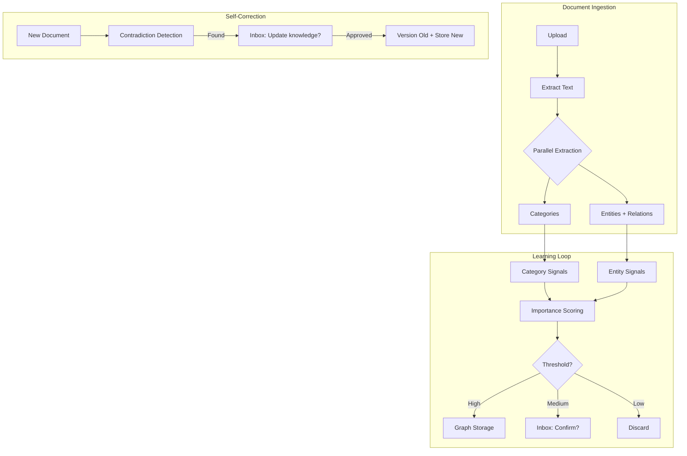

# Adaptive Entity Intelligence: Unified Knowledge Discovery

**Date**: December 28, 2024  
**Status**: Draft — Awaiting Review  
**Philosophy**: Self-Adapting Intelligence — "Learn, Propose, Evolve"

---

## Implementation Status

| Feature | Status | Implemented | Code Reference |
|---------|--------|-------------|----------------|
| [Entity Discovery](#phase-1-entity-discovery) | ⬜ Pending | — | — |
| [Confidence & Approval Gate](#phase-2-confidence--approval-gate) | ⬜ Pending | — | — |
| [Relationship Storage with History](#phase-3-relationship-storage-with-history) | ⬜ Pending | — | — |
| [Contradiction Detection](#contradiction-detection) | ⬜ Pending | — | — |
| [Role Evolution Tracking](#role-evolution-tracking) | ⬜ Pending | — | — |
| [Deduplication Suggestions](#automatic-deduplication-suggestions) | ⬜ Pending | — | — |
| [Category Integration](#integration-with-category-learning) | ⬜ Pending | — | — |
| [New Entity Type Discovery](#new-entity-type-discovery) | ⬜ Pending | — | — |

---

## Executive Summary

A unified system that **learns both WHAT matters (categories) AND WHO matters (entities)** from uploaded documents. Unlike static NER, this system:

1. **Discovers** entity types relevant to YOUR business (not hardcoded Person/Org)
2. **Infers** relationship types from context ("reports to" vs "signed with")
3. **Classifies** entity roles (employee, client, vendor, prospect)
4. **Self-corrects** as new documents reveal changes (promotions, role changes, new relationships)
5. **Integrates** with the existing category learning system for unified intelligence

> The system should know that "Alice" became "Alice Smith, VP of Sales" and that she moved from "client" to "employee" — all without being told.

---

## Core Design Principles

### 1. No Hardcoded Schemas

```
❌ Wrong: Person, Organization, Date, Money
✅ Right: System learns "Agent", "Listing", "Buyer", "Seller" for real estate
✅ Right: System learns "Patient", "Diagnosis", "Medication" for healthcare
```

### 2. Relationships Are First-Class Citizens

Entities without relationships are just tags. The power is in the graph:

```cypher
// What we want to discover automatically:
(Alice)-[:WORKS_AT {since: 2024, role: "VP Sales"}]->(AcmeCorp)
(Alice)-[:SIGNED]->(Contract)-[:REGARDING]->(Property)
(Contract)-[:WITNESSED_BY]->(Notary)
```

### 3. Temporal Versioning (Self-Correction)

The world changes. Our graph should reflect that:

```cypher
// Old knowledge (still stored for history)
(Alice)-[:WORKS_AT {role: "Sales Rep", until: 2024-06}]->(AcmeCorp)

// New knowledge (extracted from new document)
(Alice)-[:WORKS_AT {role: "VP Sales", since: 2024-06}]->(AcmeCorp)
```

### 4. Everything Needs Provenance

Every fact links to its source document:

```cypher
(Fact)-[:EXTRACTED_FROM {confidence: 0.92, line: 47}]->(Chunk)
(Chunk)-[:PART_OF]->(Document)
```

---

## Unified Architecture

### Merging Categories + Entities

The existing Adaptive Learning System watches for important **categories**.
This proposal extends it to also watch for important **entities** and **relationships**.



---

## Entity & Relationship Schema

### Adaptive Node Structure

```cypher
// Entities are NOT typed with fixed labels.
// The "entity_type" is a learned property.

(:Entity {
    id: uuid(),
    name: "Alice Smith",
    entity_type: "person",          // Learned, not hardcoded
    role: "employee",               // In context of the company
    role_confidence: 0.87,
    first_seen: datetime(),
    last_seen: datetime(),
    source_count: 5,                // How many documents mention this
    importance_score: 0.72,
    name_embedding: [...]           // For deduplication
})

(:Entity {
    id: uuid(),
    name: "Acme Corp",
    entity_type: "organization",
    role: "client",                 // This company is a client
    role_confidence: 0.94
})
```

### Learned Relationship Types

```cypher
// Relationships include provenance and temporal data
(:Entity)-[:RELATED_TO {
    relationship_type: "works_at",  // Learned from text patterns
    role_in_relation: "employee",
    since: date("2024-01"),
    until: null,                    // Still active
    confidence: 0.89,
    extracted_from: [chunk_id1, chunk_id2]
}]->(:Entity)

// Multiple relationships between same entities (temporal evolution)
(Alice)-[:RELATED_TO {relationship_type: "works_at", role: "sales_rep", until: "2024-06"}]->(AcmeCorp)
(Alice)-[:RELATED_TO {relationship_type: "works_at", role: "vp_sales", since: "2024-06"}]->(AcmeCorp)
```

### Company Profile Integration

The Company Profile (singleton node) learns the vocabulary:

```cypher
(:CompanyProfile {
    learned_entity_types: ["person", "organization", "property", "contract", "agent"],
    learned_relationship_types: ["works_at", "manages", "owns", "signed", "assigned_to"],
    role_vocabulary: ["employee", "client", "vendor", "prospect", "partner", "competitor"],
    industry_context: "real_estate"
})
```

---

## Extraction Pipeline {#extraction-pipeline}

### Phase 1: Entity Discovery {#phase-1-entity-discovery}

> **Depends on**: [Knowledge Graph Master](../../Implemented/Masters/knowledge_graph_master.md#dynamic-entity-creation)  
> **Affects**: [Confidence & Approval Gate](#phase-2-confidence--approval-gate), [RAG Retrieval](./rag_retrieval_improvements_proposal.md)

**Prompt to Gemini**:
```
You are analyzing a document for a company in the {industry} industry.

Known entity types for this company: {learned_entity_types}
Known relationship types: {learned_relationship_types}
Known roles: {role_vocabulary}

Extract all entities and relationships from this text.
You MAY discover new entity types or relationship types if they fit the context.

For each entity, identify:
- name: The entity's name
- entity_type: What kind of entity (use known types or suggest new)
- role: Their relationship to the company (employee, client, vendor, prospect, other)
- role_evidence: Quote showing why you chose this role

For each relationship, identify:
- from_entity: Name of source entity
- to_entity: Name of target entity  
- relationship_type: Type of relationship (use known types or suggest new)
- temporal_markers: Any dates or timeframes mentioned
- evidence_quote: Text that shows this relationship

Output as JSON.
```

### Phase 2: Confidence & Approval Gate

```python
async def process_extractions(entities, relationships, doc_id):
    for entity in entities:
        confidence = calculate_extraction_confidence(entity)
        
        if confidence >= 0.85:
            # High confidence: auto-store
            await store_entity(entity, doc_id)
            
        elif confidence >= 0.50:
            # Medium confidence: store but flag for review
            await store_entity(entity, doc_id, status="pending_review")
            await create_inbox_review(entity)
            
        else:
            # Low confidence: ask first
            await send_to_inbox(
                subject=f"New entity found: {entity.name}",
                body=f"I found '{entity.name}' ({entity.entity_type}) in your documents. Should I remember this?",
                actions=["Yes, remember", "No, ignore", "They're actually a {role dropdown}"]
            )
```

### Phase 3: Relationship Storage with History

```python
async def store_relationship(rel, doc_id):
    # Check if relationship already exists
    existing = await db.find_relationship(rel.from_entity, rel.to_entity, rel.type)
    
    if existing:
        # Check for contradictions
        if contradicts(existing, rel):
            await handle_contradiction(existing, rel, doc_id)
        else:
            # Strengthen existing relationship
            await strengthen_relationship(existing, doc_id)
    else:
        # New relationship
        await create_relationship(rel, doc_id)
```

---

## Self-Correction System {#self-correction-system}

### Contradiction Detection {#contradiction-detection}

> **Depends on**: [Entity Discovery](#phase-1-entity-discovery), [Relationship Storage](#phase-3-relationship-storage-with-history)  
> **Affects**: [Inbox Notifications](../../Implemented/Masters/document_lifecycle_master.md)

When new documents contain information that contradicts existing knowledge:

```python
async def handle_contradiction(old_fact, new_fact, source_doc_id):
    """
    Detected: Old says "Alice works at OldCorp"
              New says "Alice works at NewCorp"
    """
    
    # Calculate recency (newer documents might be more accurate)
    old_recency = calculate_recency(old_fact.source_docs)
    new_recency = calculate_recency([source_doc_id])
    
    # Calculate source authority (some doc types are more authoritative)
    old_authority = get_doc_authority(old_fact.source_docs)
    new_authority = get_doc_authority(source_doc_id)
    
    if new_recency > old_recency and new_authority >= old_authority:
        # Likely a genuine update
        await send_to_inbox(
            subject=f"📝 Knowledge update: {old_fact.entity.name}",
            body=f"""I found something that might be an update:

**Previously**: {old_fact.entity.name} {old_fact.description}
**Now (from {source_doc_id})**: {new_fact.description}

Should I update this?""",
            actions=[
                {"id": "update", "label": "Yes, update it"},
                {"id": "keep_both", "label": "Keep both (both are true)"},
                {"id": "ignore_new", "label": "Ignore the new info"}
            ]
        )
    else:
        # Conflict - need human resolution
        await flag_for_human_review(old_fact, new_fact, source_doc_id)
```

### Role Evolution Tracking

People change roles. Companies change relationships. Track it all:

```python
async def detect_role_change(entity, new_role, source_doc_id):
    """
    Example: "Alice Smith, VP of Sales" when we knew her as "Sales Rep"
    """
    current_role = entity.role
    
    if new_role != current_role:
        await send_to_inbox(
            subject=f"🔄 Role change detected: {entity.name}",
            body=f"""It looks like {entity.name}'s role may have changed:

**Previous role**: {current_role}
**New role found**: {new_role}
**Source**: {source_doc_id}

Should I update this?""",
            actions=[
                {"id": "update", "label": f"Yes, they're now {new_role}"},
                {"id": "add", "label": "They're both (multiple roles)"},
                {"id": "ignore", "label": "Ignore"}
            ]
        )
```

### Automatic Deduplication Suggestions

Weekly job to find potential duplicates:

```cypher
// Find entities with similar names
MATCH (a:Entity), (b:Entity)
WHERE a.id < b.id 
  AND a.entity_type = b.entity_type
  AND gds.similarity.cosine(a.name_embedding, b.name_embedding) > 0.85
RETURN a.name, b.name, a.id, b.id
```

Then surface to inbox:
> "Are 'J. Smith' and 'John Smith' the same person? [Merge] [Keep separate]"

---

## Integration with Category Learning {#integration-with-category-learning}

> **Depends on**: [Adaptive Learning System](./adaptive_learning_system_proposal.md), [Self-Correction System](#self-correction-system)  
> **Affects**: [RAG System](../../Implemented/Masters/rag_system_master.md#query-expansion-caching)

### Shared Signal System

Both entities and categories feed the same signal infrastructure:

```python
@dataclass
class Signal:
    target_type: str  # "category" or "entity"
    target_id: str
    signal_type: str  # "query_mention", "doc_frequency", "relationship_centrality"
    value: float
    timestamp: datetime
    decay_rate: float
```

### Entity Importance Scoring

Reuse the category scoring algorithm for entities:

```python
async def calculate_entity_importance(entity_id: str) -> float:
    """Same composite scoring as categories, adapted for entities."""
    
    # How often is this entity mentioned in queries?
    query_frequency = await get_entity_query_signals(entity_id)
    
    # How many documents reference this entity?
    doc_coverage = await get_entity_doc_count(entity_id) / total_doc_count
    
    # Graph centrality (PageRank on entity relationships)
    centrality = await calculate_entity_centrality(entity_id)
    
    # Is this entity connected to "important" categories?
    category_importance = await get_related_category_importance(entity_id)
    
    return (
        0.30 * query_frequency +
        0.25 * doc_coverage +
        0.25 * centrality +
        0.20 * category_importance
    )
```

### Cross-Pollination

If an entity appears heavily in a category, boost both:

```python
async def cross_pollinate_signals():
    """
    If "Alice" appears in every "contracts" document,
    Alice is probably important AND contracts is probably important.
    """
    entity_category_pairs = await db.get_entity_category_cooccurrence()
    
    for entity_id, category, cooccurrence_count in entity_category_pairs:
        if cooccurrence_count > 5:  # Significant cooccurrence
            # Signal to entity
            await create_signal(
                target_type="entity",
                target_id=entity_id,
                signal_type="category_association",
                value=0.3
            )
            # Signal to category
            await create_signal(
                target_type="category",
                target_id=category,
                signal_type="entity_association",
                value=0.2
            )
```

---

## New Entity Type Discovery

The system shouldn't be limited to known entity types:

```python
async def maybe_learn_new_entity_type(suggested_type: str, entity: Entity):
    """
    Gemini suggested an entity type we don't know.
    Should we learn it?
    """
    known_types = await get_company_profile().learned_entity_types
    
    if suggested_type not in known_types:
        # Check if we've seen this type suggested before
        occurrences = await count_type_suggestions(suggested_type, days=30)
        
        if occurrences >= 3:
            # Pattern detected - suggest learning this type
            await send_to_inbox(
                subject=f"💡 New entity type discovered: {suggested_type}",
                body=f"""I've encountered "{suggested_type}" in {occurrences} documents recently.

Examples:
{format_examples(suggested_type)}

Should I start recognizing "{suggested_type}" as an entity type?""",
                actions=[
                    {"id": "learn", "label": f"Yes, learn '{suggested_type}'"},
                    {"id": "map", "label": "It's actually a {existing type}"},
                    {"id": "ignore", "label": "Ignore"}
                ]
            )
```

---

## Implementation Phases

### Phase 1: Extraction Infrastructure (Week 1-2)
- [ ] Extend ingestion.py to call entity extraction after categorization
- [ ] Create Entity and relationship nodes with provenance
- [ ] Add embedding generation for entity names

### Phase 2: Confidence & Approval (Week 2-3)
- [ ] Implement confidence scoring for extractions
- [ ] Integrate with Inbox for medium/low confidence items
- [ ] Handle approval/rejection/modification responses

### Phase 3: Self-Correction (Week 3-4)
- [ ] Implement contradiction detection
- [ ] Add role change detection
- [ ] Create weekly deduplication job

### Phase 4: Category Integration (Week 4-5)
- [ ] Unify signal infrastructure
- [ ] Implement cross-pollination
- [ ] Add entity importance to RAG retrieval

### Phase 5: Query Enhancement (Week 5-6)
- [ ] Entity-aware search ("Show Alice's contracts")
- [ ] Graph traversal in RAG ("Who manages properties in Downtown?")
- [ ] Entity mentions in citations

---

## Why This Is Powerful

| Capability | Current State | With This System |
|------------|---------------|------------------|
| "Who is Alice?" | ❌ No answer | ✅ "Alice Smith, VP Sales at AcmeCorp" |
| "Show John's contracts" | ❌ Keyword search only | ✅ Direct graph traversal |
| Role changes | ❌ Stale data forever | ✅ Self-corrects on new docs |
| Industry adaptation | ❌ Hardcoded schemas | ✅ Learns your vocabulary |
| Duplicate handling | ❌ Separate "Tom" and "Tom H." | ✅ Suggests merges |

---

## Decision Points

> [!IMPORTANT]  
> Before implementation:
> 1. **Approval threshold**: What confidence level should auto-store vs ask? (Suggested: 0.85)
> 2. **Entity types to start**: Should we seed with any types, or pure discovery?
> 3. **Relationship depth**: Extract only direct relationships, or infer chains?
> 4. **Query integration priority**: Add to RAG search immediately, or after validation period?

---

## Related Code Files

When modifying these files, consider updating this proposal:

| File | Relevance |
|------|-----------|
| `backend/graph_service.py` | Entity creation, relationship inference |
| `backend/database.py` | Entity storage, graph queries |
| `backend/ingestion.py` | Document processing, entity extraction triggers |
| `backend/rag.py` | Entity-aware retrieval |
| `backend/schema_learner.py` | Dynamic entity type learning |
