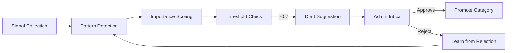

# Adaptive Learning System: Category Intelligence Engine

**Date**: December 21, 2025  
**Status**: Draft — Awaiting Review  
**Philosophy**: Preemptive AI — "Propose, Don't Dispose"

---

## Implementation Status

| Feature | Status | Implemented | Code Reference |
|---------|--------|-------------|----------------|
| [Signal Architecture](#signal-architecture) | ✅ Complete | 2025-12-25 | `learning_engine.py:collect_query_signals` |
| [Neo4j Data Model](#neo4j-data-model) | ⬜ Pending | — | — |
| [Time-Decayed Scoring](#1-time-decayed-importance-scoring) | ⬜ Pending | — | — |
| [Anomaly Detection](#2-anomaly-detection-for-signals) | ⬜ Pending | — | — |
| [Graph Centrality](#3-graph-based-category-relationships) | ✅ Complete | 2025-12-25 | `category_intelligence.py:calculate_document_overlap` |
| [Embedding Proximity](#4-embedding-based-category-similarity) | ✅ Complete | 2025-12-25 | `category_intelligence.py:calculate_semantic_similarity` |
| [Composite Scoring](#composite-importance-algorithm) | ✅ Complete | 2025-12-25 | `learning_engine.py:analyze_category` |
| [Promotion Workflow](#promotion-workflow) | ✅ Complete | 2025-12-25 | `learning_engine.py:check_for_promotions` |
| [Rejection Learning](#learning-from-rejections) | ✅ Complete | 2025-12-25 | `learning_engine.py:handle_promotion_action` |
| [Scheduled Jobs](#scheduled-jobs) | ✅ Complete | 2025-12-25 | `main.py:scheduled_tasks` |

---

## Executive Summary

An intelligent learning engine that observes company behavior patterns and **proactively suggests** category promotions to admin. The system:

1. **Watches** user interactions, document patterns, and query behaviors
2. **Learns** which categories are critical to the business
3. **Proposes** category promotions via friendly inbox messages
4. **Never acts** without explicit admin approval

> The goal is to reduce admin friction to a single "Approve" click — *exactly like drafting an email they only need to send.*

---

## Core Philosophy: Sentinel-Style Learning

Borrowing from our [Preemptive AI Strategy](file:///Users/dora/Documents/Davlon_Gamma/Docs/Proposals/preemptive_ai_strategy.md):

```
Preemptive AI watches. It learns. It drafts suggestions.
But it NEVER executes the final mile without human confirmation.
```

### The Learning Loop



---

## Signal Architecture {#signal-architecture}

> **Depends on**: [Knowledge Graph Master](../../Implemented/Masters/knowledge_graph_master.md)  
> **Affects**: [Composite Scoring](#composite-importance-algorithm), [Entity Intelligence](./adaptive_entity_intelligence_proposal.md#integration-with-category-learning)

### 1. User Interaction Signals

Stored as `(:Signal)` nodes connected to categories and queries.

#### Positive Signals (Importance Indicators)

| Signal | Weight | Description |
|--------|--------|-------------|
| **High Query Frequency** | +0.3 | Category queried 3x+ more than baseline |
| **Citation Trust** | +0.4 | Users don't challenge or clarify — they trust it |
| **Follow-up Satisfaction** | +0.3 | Low follow-up rate = complete answers |
| **Document Velocity** | +0.2 | Category receives frequent new uploads |
| **Cross-Reference Density** | +0.3 | Other categories frequently reference this one |
| **Query Complexity** | +0.2 | Complex, multi-part questions indicate reliance |

#### Negative Signals (Caution Indicators)

| Signal | Weight | Description |
|--------|--------|-------------|
| **Correction Rate** | -0.4 | Users frequently correct or dispute answers |
| **Clarification Requests** | -0.3 | "What do you mean?" follow-ups |
| **Ignored Citations** | -0.2 | Users don't click on source links |
| **Supersession Velocity** | -0.3 | Documents frequently replaced = unstable category |

---

## Neo4j Data Model

### Graph Schema

```cypher
// Core Nodes
(:Category {
    name: "compliance",
    is_special: false,
    created_at: datetime(),
    promoted_at: null,
    importance_score: 0.0,
    observation_start: datetime()
})

(:Signal {
    id: uuid(),
    type: "query_frequency" | "citation_trust" | "correction_rate" | ...,
    value: 0.8,          // Normalized 0-1
    timestamp: datetime(),
    decay_rate: 0.05     // How fast this signal loses relevance
})

(:Observation {
    id: uuid(),
    period: "weekly",
    computed_at: datetime(),
    metrics: {
        query_count: 145,
        citation_rate: 0.82,
        follow_up_rate: 0.12,
        correction_rate: 0.03
    }
})

(:PromotionSuggestion {
    id: uuid(),
    category: "compliance",
    confidence: 0.78,
    reasoning: "High query frequency + low correction rate",
    status: "pending" | "approved" | "rejected",
    created_at: datetime()
})
```

### Relationships

```cypher
(:Category)-[:HAS_SIGNAL]->(:Signal)
(:Category)-[:HAS_OBSERVATION]->(:Observation)
(:PromotionSuggestion)-[:SUGGESTS_PROMOTE]->(:Category)
(:Signal)-[:TRIGGERED_BY]->(:Query)
(:Signal)-[:RELATED_TO]->(:Document)
```

---

## Machine Learning Components {#machine-learning-components}

> **Depends on**: [Signal Architecture](#signal-architecture), [Neo4j Data Model](#neo4j-data-model)  
> **Affects**: [Promotion Workflow](#promotion-workflow)

### 1. Time-Decayed Importance Scoring {#1-time-decayed-importance-scoring}

Signals decay over time to ensure the system reflects current business priorities, not historical patterns.

```python
def calculate_importance_score(category: str) -> float:
    """
    Calculate time-decayed importance score for a category.
    
    Uses exponential decay: signal_weight * e^(-λ * days_old)
    """
    signals = await db.get_category_signals(category)
    
    score = 0.0
    now = datetime.now()
    
    for signal in signals:
        age_days = (now - signal.timestamp).days
        decay = math.exp(-signal.decay_rate * age_days)
        
        # Apply signal weight with decay
        signal_contribution = signal.weight * signal.value * decay
        score += signal_contribution
    
    return min(max(score, 0.0), 1.0)  # Clamp to [0, 1]
```

### 2. Anomaly Detection for Signals

Detect unusual spikes that might indicate a category becoming critical.

```python
class CategorySentinel:
    """Watches for anomalous patterns in category usage."""
    
    async def detect_anomalies(self, category: str) -> List[Anomaly]:
        # Get last 30 days of observations
        observations = await db.get_observations(category, days=30)
        
        metrics = {
            'query_count': [o.metrics['query_count'] for o in observations],
            'correction_rate': [o.metrics['correction_rate'] for o in observations]
        }
        
        anomalies = []
        
        for metric_name, values in metrics.items():
            if len(values) < 7:
                continue  # Need minimum data
            
            # Calculate rolling mean and std
            mean = np.mean(values[-7:])
            std = np.std(values[-7:]) or 0.1  # Avoid division by zero
            
            # Check if latest value is anomalous (>2σ)
            latest = values[-1]
            z_score = (latest - mean) / std
            
            if abs(z_score) > 2:
                anomaly_type = 'spike' if z_score > 0 else 'drop'
                anomalies.append(Anomaly(
                    metric=metric_name,
                    type=anomaly_type,
                    z_score=z_score,
                    value=latest,
                    baseline=mean
                ))
        
        return anomalies
```

### 3. Graph-Based Category Relationships

Use Neo4j's graph algorithms to discover category importance through structural analysis.

```python
async def calculate_graph_centrality(category: str) -> float:
    """
    Calculate category importance via PageRank on document references.
    
    Categories that are frequently referenced by other categories
    score higher (like how Google ranks authoritative pages).
    """
    query = """
    CALL gds.pageRank.stream('categoryGraph', {
        maxIterations: 20,
        dampingFactor: 0.85
    })
    YIELD nodeId, score
    WHERE gds.util.asNode(nodeId).name = $category
    RETURN score
    """
    result = await db.run_query(query, {"category": category})
    return result[0]['score'] if result else 0.0
```

### 4. Embedding-Based Category Similarity

Detect when a category's documents cluster near "special" category embeddings.

```python
async def calculate_embedding_proximity_to_special(category: str) -> float:
    """
    Measure how semantically similar a category's documents are
    to documents in known special categories.
    
    If 'contracts' documents cluster near 'legal' documents,
    'contracts' might deserve special treatment too.
    """
    # Get average embedding for category
    category_embedding = await get_category_centroid(category)
    
    # Get average embeddings for all special categories
    special_categories = await db.get_special_categories()
    special_embeddings = [await get_category_centroid(sc) for sc in special_categories]
    
    # Calculate max similarity
    similarities = [
        cosine_similarity(category_embedding, se) 
        for se in special_embeddings
    ]
    
    return max(similarities) if similarities else 0.0
```

---

## Composite Importance Algorithm

```python
@dataclass
class CategoryAnalysis:
    category: str
    signal_score: float       # Time-decayed signal importance
    graph_centrality: float   # PageRank-style structural importance  
    embedding_proximity: float # Similarity to special categories
    anomaly_score: float      # Recent unusual patterns
    composite_score: float    # Weighted combination
    confidence: float         # How reliable is this assessment

async def analyze_category(category: str) -> CategoryAnalysis:
    """
    Multi-factor analysis of category importance.
    
    Composite = 0.4 * signal_score 
              + 0.25 * graph_centrality 
              + 0.2 * embedding_proximity
              + 0.15 * anomaly_boost
    """
    signal_score = await calculate_importance_score(category)
    graph_centrality = await calculate_graph_centrality(category)
    embedding_proximity = await calculate_embedding_proximity_to_special(category)
    
    # Anomaly detection (boosts score if positive pattern detected)
    anomalies = await CategorySentinel().detect_anomalies(category)
    anomaly_boost = sum(0.1 for a in anomalies if a.type == 'spike') 
    
    composite = (
        0.40 * signal_score +
        0.25 * graph_centrality +
        0.20 * embedding_proximity +
        0.15 * min(anomaly_boost, 0.3)  # Cap anomaly contribution
    )
    
    # Confidence based on data volume
    signal_count = await db.count_category_signals(category)
    confidence = min(signal_count / 50, 1.0)  # Max confidence at 50+ signals
    
    return CategoryAnalysis(
        category=category,
        signal_score=signal_score,
        graph_centrality=graph_centrality,
        embedding_proximity=embedding_proximity,
        anomaly_score=anomaly_boost,
        composite_score=composite,
        confidence=confidence
    )
```

---

## Promotion Workflow {#promotion-workflow}

> **Depends on**: [Composite Scoring](#composite-importance-algorithm)  
> **Affects**: [Inbox Notifications](../../Implemented/Masters/document_lifecycle_master.md), [Category System](../../Implemented/Masters/knowledge_graph_master.md#7-category-management)

### Trigger Conditions

```python
PROMOTION_THRESHOLD = 0.70  # Composite score needed
CONFIDENCE_THRESHOLD = 0.60  # Minimum confidence needed
OBSERVATION_DAYS = 7         # Minimum observation period

async def check_for_promotions():
    """Periodic job to check if any category should be promoted."""
    categories = await db.get_all_categories()
    
    for cat in categories:
        if cat.is_special:
            continue  # Already special
        
        # Check minimum observation period
        days_observed = (datetime.now() - cat.observation_start).days
        if days_observed < OBSERVATION_DAYS:
            continue
        
        # Check rejection cooldown
        if cat.rejection_cooldown and cat.rejection_cooldown > datetime.now():
            continue  # Still in cooldown from previous rejection
        
        analysis = await analyze_category(cat.name)
        
        if (analysis.composite_score >= PROMOTION_THRESHOLD and 
            analysis.confidence >= CONFIDENCE_THRESHOLD):
            
            await create_promotion_suggestion(analysis)
```

### Inbox Message Generation

```python
async def create_promotion_suggestion(analysis: CategoryAnalysis):
    """Create a friendly inbox message suggesting category promotion."""
    
    # Build human-readable reasoning (NO TECHNICAL TERMS)
    reasons = []
    if analysis.signal_score > 0.5:
        reasons.append("your team asks about these a lot")
    if analysis.graph_centrality > 0.3:
        reasons.append("they're connected to many other documents")
    if analysis.embedding_proximity > 0.6:
        reasons.append("they seem similar to documents I already treat carefully")
    if analysis.anomaly_score > 0:
        reasons.append("they've been getting more attention lately")
    
    reasoning_text = ", and ".join(reasons) if len(reasons) > 1 else reasons[0] if reasons else "they seem important"
    
    message = f"""I've noticed that your "{analysis.category.replace('_', ' ')}" documents are important — {reasoning_text}.

Would you like me to give them extra attention?

If you say yes, I'll:
• Be more careful when quoting from them
• Double-check my answers more thoroughly
• Give you stronger warnings if they're outdated

Nothing about your documents will change — just how carefully I handle them."""
    
    await db.create_inbox_message(
        subject=f"💡 Should I pay more attention to {analysis.category.replace('_', ' ')}?",
        body=message,
        type="promotion_suggestion",
        metadata={
            "category": analysis.category,
            "composite_score": analysis.composite_score,
            "confidence": analysis.confidence
        },
        actions=[
            {"id": "approve", "label": "Yes, give them extra attention"},
            {"id": "reject", "label": "No, they're fine as is"},
            {"id": "remind", "label": "Ask me later"}
        ]
    )
```

---

## Learning from Rejections

When an admin rejects a promotion, the system learns.

```python
async def handle_rejection(category: str):
    """Learn from rejected promotion suggestions — rejections decay over time."""
    
    # Record rejection with decay
    await db.create_signal(
        category=category,
        type="admin_rejection",
        value=-0.3,  # Moderate negative signal
        decay_rate=0.02  # Decays over ~50 days
    )
    
    # Temporarily increase threshold (will decay back naturally)
    await db.run_query("""
        MATCH (c:Category {name: $category})
        SET c.rejection_cooldown = datetime() + duration({days: 30})
    """, {"category": category})
    
    logger.info(f"Rejection recorded for {category}, cooldown for 30 days")
```

---

## Scheduled Jobs

```python
# Cron-style scheduling
JOBS = {
    "signal_collection": "*/5 * * * *",    # Every 5 minutes
    "observation_compute": "0 0 * * *",     # Daily at midnight
    "promotion_check": "0 9 * * 1",         # Weekly, Monday 9 AM
    "signal_cleanup": "0 0 1 * *"           # Monthly: prune old signals
}
```

### Signal Collection (Every 5 min)

```python
async def collect_signals():
    """Collect signals from recent queries."""
    recent_queries = await db.get_queries_since(minutes_ago=5)
    
    for query in recent_queries:
        # Query frequency signal
        for category in query.detected_categories:
            await db.create_signal(
                category=category,
                type="query",
                value=1.0,
                triggered_by=query.id
            )
        
        # Check for follow-ups (indicates incomplete answer)
        if query.had_followup:
            for category in query.sources_categories:
                await db.create_signal(
                    category=category,
                    type="followup_required",
                    value=-0.3
                )
```

---

## Benefits Summary

| Benefit | Description |
|---------|-------------|
| **Zero Configuration** | System learns what's important automatically |
| **Human-in-the-Loop** | All changes require explicit approval |
| **Continuous Improvement** | Learns from approvals AND rejections |
| **Multi-Signal Fusion** | Combines usage, structure, and semantics |
| **Time-Aware** | Recent patterns weighted more than old ones |
| **Explainable** | Every suggestion includes human-readable reasoning |

---

## Implementation Phases

### Phase 1: Signal Infrastructure (Week 1-2)
- [ ] Create `Signal`, `Observation`, `PromotionSuggestion` Neo4j nodes
- [ ] Implement signal collection from query flow
- [ ] Set up scheduled jobs

### Phase 2: Scoring Engine (Week 3)
- [ ] Implement time-decayed importance scoring
- [ ] Add anomaly detection
- [ ] Integrate with existing category system

### Phase 3: Graph Intelligence (Week 4)
- [ ] Set up Neo4j GDS for PageRank
- [ ] Implement embedding proximity calculation
- [ ] Build composite scoring

### Phase 4: Inbox Integration (Week 5)
- [ ] Create promotion suggestion messages
- [ ] Handle approve/reject actions
- [ ] Implement rejection learning

---

## Decisions Made

| Question | Decision |
|----------|----------|
| Show confidence meter? | **No** — keep it simple |
| Observation period | **7 days** |
| Rejection behavior | **Expires over time** (30 day cooldown, then decay) |
| Force promote override | **Not needed** — system should be good enough |

---

## Related Code Files

When modifying these files, consider updating this proposal:

| File | Relevance |
|------|-----------|
| `backend/learning_engine.py` | Signal collection, scoring algorithms |
| `backend/database.py` | Signal storage, observation queries |
| `backend/rag.py` | Category awareness, query classification |
| `backend/ingestion.py` | Document velocity tracking |
